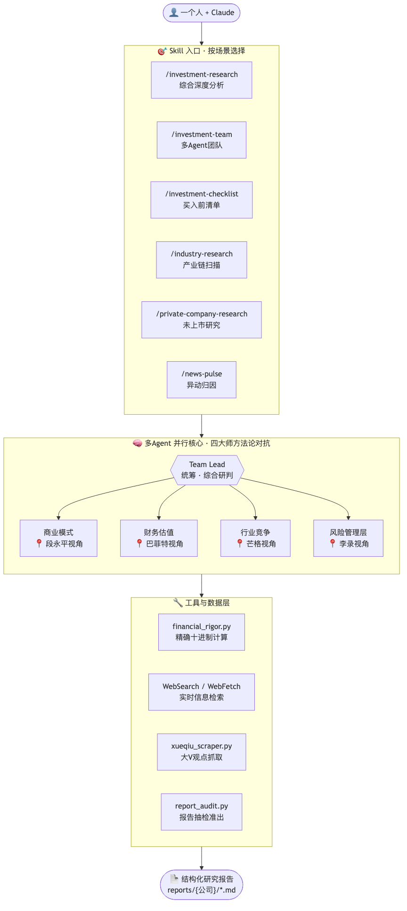

English | [中文](README.md)

[](https://trendshift.io/repositories/63696)

# AI Berkshire — Value Investing Research Framework for the AI Era

> "Price is what you pay, value is what you get." — Warren Buffett
>
> Redefining the depth and efficiency of investment research with AI.

**AI Berkshire** is a collection of investment research skills compatible with both Claude Code and Codex. It systematizes the methodologies of four value investing masters — Buffett, Munger, Duan Yongping, and Li Lu — and delivers professional-grade research through AI Agents.

One person + Claude Code / Codex = an entire investment research team.

[Track Record](#real-track-record) · [Why Not Just Ask AI?](#why-cant-you-just-ask-ai-directly) · [Skills](#skills-overview-18-skills) · [Quick Start](#quick-start) · [Reports](#live-research-reports) · [Design Philosophy](#design-philosophy)

---

## Real Track Record

> Not paper trading. This framework is backed by a real-money, audited portfolio.

### 2024 Full-Year Return: +69.29%


### 2025 Full-Year Return: +66.38%


### Benchmark Comparison

| Benchmark | 2024 Full Year | 2025 Full Year |
|-----------|---------------|----------|
| **This Framework (Live)** | **+69.29%** | **+66.38%** |
| Hang Seng Index | +17.67% | +27.77% |
| S&P 500 | +23.31% | +16.39% |
| CSI 300 | +14.68% | +17.66% |
| NASDAQ Composite | +28.64% | +20.36% |

**2024 Alpha**: Beat the S&P 500 by **46 percentage points**, beat the Hang Seng by **52 percentage points**

**2025 Alpha**: Beat the S&P 500 by **50 percentage points**, beat the Hang Seng by **39 percentage points**

**Cumulative live returns exceed ¥1.46 million over two years**, significantly outperforming all major global indices for two consecutive years.

> *Disclaimer: Past performance does not guarantee future results. Screenshots are from a real brokerage account (Futu Securities).*

---

## Why Can't You Just Ask AI Directly?

You can, of course, ask Claude: "Should I buy Pinduoduo?" You'll get a balanced "on one hand... on the other hand..." analysis that ends with "investing involves risks, please make your own judgment."

**That kind of analysis looks right but can't drive actual decisions.**

AI Berkshire doesn't solve the "can AI analyze?" problem — it solves the **analysis quality and decision discipline** problem. Here's what's different:

### 1. Forces a Verdict — No Fence-Sitting

Ask AI directly, and you get a both-sides-pleasing "analysis." AI Berkshire forces concrete output: **Pass / Fail / Gray Zone**, with specific price ranges and tiered recommendations.

> Vanilla AI response: *"Pinduoduo has growth potential but also faces competitive pressure. Investors should weigh..."*
>
> AI Berkshire output:

> | Strategy | Recommendation | Price Range |
> |----------|---------------|-------------|
> | Aggressive | Build 20% position at current price | $95–105 |
> | Moderate | Wait for buyback policy clarity | $85–95 |
> | Conservative | Doesn't meet 10-year certainty bar — pass | — |
>
> **Mirror Test**: If you can't articulate it in 5 sentences = don't buy. No exceptions.

### 2. Four-Master Dialectic, Not a Single Perspective

It's not just "analyze this using Buffett's method." The four perspectives create **real tension and contradictions** —

Take Pinduoduo as an example:
- **Duan Yongping** (business model): Great business, C2M model hard to replicate → 3.7/5
- **Buffett** (financial valuation): Ex-cash P/E just 6.3x, a cash machine → 4.4/5
- **Munger** (inversion): Moat shallower than it appears — Douyin hit ¥4 trillion GMV in 3 years → 3.5/5
- **Li Lu** (long-term certainty): Management culture concerns, uncertain in 10 years → 2.0/5

**Buffett says "genuinely cheap," Li Lu says "if uncertain, don't buy"** — this conflict is the real state of investment decisions. A single prompt can't produce this multi-perspective dialectic, yet it's precisely what prevents blind spots.

### 3. Structured Anti-Bias Mechanisms

AI's greatest danger isn't giving wrong answers — it's giving answers that **look right but don't withstand scrutiny**. AI Berkshire embeds multiple "anti-deception" layers into the process:

| Mechanism | Problem Solved | Example |
|-----------|---------------|---------|
| **Information Richness Rating (A/B/C)** | Prevents "more data = more certainty" illusion | Pop Mart rated B: limited data, estimated metrics flagged with confidence levels |
| **Munger-Style Inversion Test** | Forces thinking about failure scenarios | "How could Pinduoduo die?" → Lists 5 scenarios with probabilities |
| **Quick-Kill Checklist** | 8 red lines, any one is a veto | Management integrity issues → immediate rejection regardless of valuation |
| **Contrarian Check** | Avoids thinking like the crowd | "Why are smart people shorting this?" → Surfaces overlooked risks |
| **Intellectual Honesty** | Prefer "I don't know" | Marks data gaps as "gray zone" rather than filling certainty with speculation |

### 4. Financial Data Precision

LLMs can't do mental math reliably. Getting a P/E wrong by one decimal point or confusing HKD with CNY can lead to catastrophic investment decisions.

**Real case**: When analyzing Tencent, different sources reported market cap in "HKD billions" and "CNY billions." AI Berkshire's approach:

```bash
# Market cap manual verification: Price × Shares Outstanding, cross-checked with reported data
python3 tools/financial_rigor.py verify-market-cap \
  --price 510 --shares 9.11e9 --reported 4.65e12 --currency HKD
# ✅ Verified — deviation only 0.08%
```

All calculations use Python `decimal.Decimal` (exact decimal arithmetic), not `float`. Key data requires at least 2 independent sources for cross-validation.

### 5. Reproducible Research Process

Ask AI directly, and the format, depth, and coverage vary every time — today's Tencent analysis has a moat score, tomorrow's Meituan analysis might forget it.

AI Berkshire ensures: **Same input → structurally consistent, equally deep output.** This means you can:
- Compare 7 companies side by side with identical scoring criteria
- Re-analyze the same company 6 months later and directly compare changes
- Align research outputs across team members

> Real output — 7 companies screened with the same Checklist:
>
> | Company | Verdict | Circle of Competence | Good Business | Moat | Management | Margin of Safety | Overall |
> |---------|:-------:|:-------------------:|:------------:|:----:|:----------:|:---------------:|:-------:|
> | Kweichow Moutai | ✅ Pass | ★★★★★ | ★★★★★ | ★★★★★ | ★★★☆☆ | ★★★★☆ | 4.7 |
> | Tencent | ✅ Pass | ★★★★☆ | ★★★★★ | ★★★★★ | ★★★★★ | ★★★★☆ | 4.7 |
> | NVIDIA | ✅ Conditional | ★★★★☆ | ★★★★★ | ★★★★★ | ★★★★★ | ★★★☆☆ | 4.3 |
> | Meituan | ✅ Conditional | ★★★★☆ | ★★★★☆ | ★★★★☆ | ★★★★☆ | ★★★★☆ | 4.0 |
> | Kuaishou | ✅ Conditional | ★★★☆☆ | ★★★★☆ | ★★★★☆ | ★★★★☆ | ★★★★★ | 4.0 |
> | Pinduoduo | ❓ Gray | ★★★★☆ | ★★★★☆ | ★★★☆☆ | ★★★☆☆ | ★★★★★ | 3.8 |
> | Pop Mart | ❓ Gray | ★★★☆☆ | ★★★★☆ | ★★★★☆ | ★★★★★ | ★★★☆☆ | 3.7 |

### 6. Multi-Agent Parallelism = Multiplied Research Depth

`/investment-team` launches 4 independent Agents to research a company **simultaneously**. Each Agent conducts its own web searches, cross-validates data, and reaches independent conclusions. This isn't splitting one prompt into four sections — it's 4 "analysts" each doing complete research, with a Team Lead synthesizing the final call.

Ask AI directly, and you have one context window. Four parallel Agents means 4× the search volume, 4× the information sources, and 4 independent perspectives.

```
┌─────────────────────────────────────────────────────────┐
│                   Team Lead (You)                        │
│            Coordinate · Synthesize · Decide              │
├──────────┬──────────┬──────────────┬───────────────┤
│ Agent 1        │ Agent 2        │ Agent 3              │ Agent 4               │
│ Business Model │ Financials     │ Industry &           │ Risk &                │
│ Duan Yongping  │ Buffett        │ Competition          │ Management            │
│                │                │ Munger               │ Li Lu                 │
└──────────┴──────────┴──────────────┴───────────────┘
         ↓ Parallel research, real-time progress ↓
                  Final Synthesized Report
```

### In One Sentence

> **Regular users asking AI get "analysis that looks right." With AI Berkshire, you get "research reports you can actually make decisions from."**

---

## Architecture

<p align="center">
  
</p>

> Source: [`assets/architecture.mmd`](assets/architecture.mmd) (editable Mermaid diagram)

**Three-Layer Design Philosophy**:
- **Skill Layer**: Abstracts "what you want to do" into 18 clear entry points — deep research, earnings analysis, industry screening, portfolio management, and thinking tools. Pick by scenario.
- **Agent Layer**: Each skill runs 4 Agents in parallel — they search independently, judge independently, challenge each other, and the Team Lead synthesizes.
- **Tool Layer**: Exact-precision calculations, real-time web search, report auditing — ensures every report's data is rigorous and verifiable.

---

## Skills Overview (18 Skills)

### 🔬 Deep Research

| Skill | Purpose | When to Use |
|-------|---------|-------------|
| [`/investment-research`](skills/investment-research.md) | Four-master comprehensive analysis | Full-spectrum research on a public company |
| [`/investment-team`](skills/investment-team.md) | Multi-Agent parallel research team | 4 Agents in parallel — fastest and most comprehensive |
| [`/management-deep-dive`](skills/management-deep-dive.md) | Management deep dive | "Buying a stock is buying its people" — when management is the key variable |
| [`/private-company-research`](skills/private-company-research.md) | Private company research | Research info-scarce private companies like Ant Group, SpaceX |
| [`/deep-company-series`](skills/deep-company-series.md) | 8-part long-form deep dive series | Publication-grade series, ~120K words from cognitive reset to decision closure |

### 📊 Earnings Analysis

| Skill | Purpose | When to Use |
|-------|---------|-------------|
| [`/earnings-review`](skills/earnings-review.md) | Earnings deep read (primary sources) | Read raw filings only — no sell-side reports — like Buffett reads annual reports |
| [`/earnings-team`](skills/earnings-team.md) | Earnings team + publishable article | Four masters interpret earnings in parallel → editor polish → reader review → publish-ready |

### 🏭 Industry Screening

| Skill | Purpose | When to Use |
|-------|---------|-------------|
| [`/industry-research`](skills/industry-research.md) | Industry value chain scan | Map all investment opportunities across an industry's value chain |
| [`/industry-funnel`](skills/industry-funnel.md) | Industry funnel screening | Full market → rough cut ≤10 → final pick 3, with deep analysis |
| [`/quality-screen`](skills/quality-screen.md) | Quality screen (7 hard metrics) | Quickly eliminate non-first-class companies; supports single stock / industry / index / thematic batch screening |
| [`/bottleneck-hunter`](skills/bottleneck-hunter.md) | Supply-chain bottleneck hunter | Start from a supertrend and find physical supply-chain bottlenecks and arbitrage opportunities |
| [`/investment-checklist`](skills/investment-checklist.md) | Buffett pre-buy checklist | Six gates, 10-minute decision on whether to dig deeper |

### 📈 Portfolio Management

| Skill | Purpose | When to Use |
|-------|---------|-------------|
| [`/portfolio-review`](skills/portfolio-review.md) | Portfolio review & optimization | Graduate from "researching companies" to "managing a portfolio" — sizing, concentration, rebalancing |
| [`/thesis-tracker`](skills/thesis-tracker.md) | Investment thesis tracker | Post-buy discipline system: continuously track whether your thesis has been falsified |
| [`/news-pulse`](skills/news-pulse.md) | Price-move rapid attribution | When a stock surges or drops — figure out "what happened" in 10 minutes |

### 🧠 Thinking Tools

| Skill | Purpose | When to Use |
|-------|---------|-------------|
| [`/dyp-ask`](skills/dyp-ask.md) | Duan Yongping Q&A | Think through any question the Duan Yongping way — business, investing, life |
| [`/financial-data`](skills/financial-data.md) | Financial data retrieval & cross-validation | Ensure key data comes from 2+ independent sources; alerts on >1% deviation |
| [`/wechat-article`](skills/wechat-article.md) | WeChat article workflow | Author, editor, and reader Agents collaborate to produce a publishable article |

---

## Quick Start

### Cost & Model Selection

Deep-research skills run multiple research passes, cross-source checks, and multi-agent synthesis by design, so they can consume a large number of tokens. That cost is part of getting fuller coverage across business quality, financials, industry structure, and risk.

For high-stakes investment decisions, the maintainer's view is that the strongest model usually offers the best analysis ROI; saving model cost should not come at the expense of important judgment quality. Lighter models can be useful for triage, summarization, or low-risk questions, but moat, valuation, management, and risk synthesis should be expected to depend more heavily on model capability.

To control cost, adjust the workflow before expecting a full deep-research run to become cheap: use [`/quality-screen`](skills/quality-screen.md) first to rule out weaker companies, or [`/news-pulse`](skills/news-pulse.md) for quick price-move attribution. Run [`/investment-research`](skills/investment-research.md) or [`/investment-team`](skills/investment-team.md) only when the result is worth deeper work.

### 1. Install an AI Client

This repository keeps one canonical workflow and provides Claude Code commands plus Codex skills. Install the client you plan to use.

For Claude Code users:

```bash
npm install -g @anthropic-ai/claude-code
```

For Codex users on macOS / Linux:

```bash
# macOS / Linux
curl -fsSL https://chatgpt.com/codex/install.sh | sh

# Or use npm
npm install -g @openai/codex

# Or use Homebrew
brew install --cask codex

# Verify installation
codex --version
```

Windows users can use the official PowerShell installer: `powershell -ExecutionPolicy ByPass -c "irm https://chatgpt.com/codex/install.ps1 | iex"`.

If `codex --version` prints a version, you can continue with this project's Codex skills installation.

#### Reducing Approval Prompts

These skills issue many tool calls, and Claude Code asks for approval for each one by default. That behavior comes from Claude Code's client-side permission system; it is not a repository default this project can change.

If you trust the current workflow and are running in a trusted environment, start Claude Code in skip-permissions mode:

```bash
claude --dangerously-skip-permissions
```

Warning: this disables Claude Code's tool-approval guardrails. Use it only when you trust the repository, commands, and working directory.

### 2. Install Skills

For Claude Code users on macOS / Linux:

```bash
# Clone the repository
git clone https://github.com/xbtlin/ai-berkshire.git

# Copy skills to the current project's .claude/commands directory
cd ai-berkshire
./scripts/install-claude-commands.sh
```

For Claude Code users on Windows PowerShell / Command Prompt:

```bat
git clone https://github.com/xbtlin/ai-berkshire.git
cd ai-berkshire
.\scripts\install-claude-commands.bat
```

For Codex users on macOS / Linux:

```bash
# Clone the repository
git clone https://github.com/xbtlin/ai-berkshire.git

# Generate and install Codex skills to the current project's .codex/skills
cd ai-berkshire
./scripts/install-codex-skills.sh

# Optional: install Codex slash prompts to the current project's .codex/prompts
# for a Claude Code-like /investment-research entry point
./scripts/install-codex-prompts.sh
```

For Codex users on Windows PowerShell / Command Prompt:

```bat
git clone https://github.com/xbtlin/ai-berkshire.git
cd ai-berkshire
.\scripts\install-codex-skills.bat

REM Optional: install Codex slash prompts
.\scripts\install-codex-prompts.bat
```

The repository maintains three entry points: `skills/*.md` are the Claude Code command sources; `codex-skills/*/SKILL.md` are Codex skill packages generated from `skills/*.md` by `scripts/sync-codex-skills.py`; `codex-prompts/*.md` are an optional Codex slash-prompt compatibility layer.

### 3. Use

Invoke directly in Claude Code:

```bash
# Deep Research
/investment-research Tencent
/investment-team Meituan
/management-deep-dive Wang Xing, Meituan
/private-company-research SpaceX
/deep-company-series Pinduoduo

# Earnings Analysis
/earnings-review Tencent 2025Q4
/earnings-team PDD 2025 Annual

# Industry Screening
/industry-research Nuclear Power
/industry-funnel AI Compute
/quality-screen Hang Seng Index Constituents
/bottleneck-hunter AI Infrastructure
/investment-checklist Moutai, NVIDIA, Apple

# Portfolio Management
/portfolio-review Tencent 30%, Meituan 20%, Moutai 20%, Cash 30%
/thesis-tracker Pinduoduo
/news-pulse Tencent

# Thinking Tools
/dyp-ask Where is Pinduoduo's real moat?
/wechat-article Meituan
```

After installing for Codex, restart Codex and refer to skills by name, for example:

```text
Use investment-research to research Tencent
Use earnings-review to analyze PDD 2025 annual results
Use industry-funnel to screen AI compute
Use bottleneck-hunter to scan AI infrastructure bottlenecks
Use wechat-article to write a Meituan investment article
```

If you install Codex slash prompts, restart Codex and search for them in the `/` menu. Codex's official custom prompt entry point usually appears as `prompts:<name>`, for example:

```text
/prompts:investment-research Tencent
```

---

## Detailed Skill Descriptions

### 1. `/investment-research` — Four-Master Comprehensive Analysis

The most thorough single-company deep research framework. Executes seven modules in sequence:

```
Data Collection → Business Essence (Duan Yongping) → Moat (Buffett) → Inversion (Munger)
    → Management Assessment (Duan Yongping + Buffett) → Civilizational Trends (Li Lu)
    → Valuation & Margin of Safety
```

**Key Features**:
- AI research bias awareness mechanism (A/B/C information richness rating)
- Multi-source cross-validation on key data (manual market cap calculation, 2+ independent sources)
- Each master's "follow-up questions" woven throughout
- Three-scenario valuation (bull/base/bear) + reverse DCF

**Sample Output Excerpt**:

> #### Comprehensive Decision Memo
>
> | Dimension | Conclusion | Confidence |
> |-----------|-----------|------------|
> | Business Quality (Duan Yongping) | Excellent: platform business, two-sided network effects, near-zero marginal cost | ★★★★★ |
> | Moat (Buffett) | Wide and widening: network effects + switching costs + scale economies, triple-layered | ★★★★☆ |
> | Management (Duan Yongping + Buffett) | Strong: founder-led, excellent capital allocation discipline | ★★★★☆ |
> | Top Risk (Munger) | Regulatory policy uncertainty; new business losses dragging overall profits | ★★★☆☆ |
> | Civilizational Trend (Li Lu) | Aligned with digital consumption trends, but not a "civilization-level paradigm shift" | ★★★★☆ |
> | Valuation (Buffett + Duan Yongping) | Current P/E 18x, slightly below historical median, modest margin of safety | ★★★★☆ |
>
> **Duan Yongping**: "The essence of this business is connecting consumers and merchants — profiting from efficiency gains. The hallmark of a great business: more users bring more merchants, more merchants bring more users. Once the flywheel spins, it's very hard to stop."
>
> **Munger**: "Invert, always invert — if this company vanished tomorrow, what would users and merchants do? If the answer is 'quickly find a substitute,' the moat isn't deep enough. If the answer is 'life would become very inconvenient,' that's worth paying attention to."

---

### 2. `/investment-team` — Multi-Agent Research Team

Launches 4 AI Agents in parallel, simulating a real investment research team. Each Agent searches independently, analyzes independently, and delivers independent ratings. The Team Lead synthesizes the final judgment.

**Sample Output Excerpt**:

> #### One-Line Conclusion
> Meituan is the undisputed leader in China's local life services, with multi-layered network effect moats. Current valuation sits at historically low levels — significant long-term value. Recommend accumulating on dips.
>
> #### Four-Dimension Scorecard
>
> | Dimension | Framework | Score | Core Judgment |
> |-----------|-----------|-------|---------------|
> | Business Model & Moat | Duan Yongping | ★★★★☆ | Strong two-sided network effects; food delivery + in-store form a flywheel |
> | Financials & Valuation | Buffett | ★★★★☆ | Core business margins improving steadily; valuation at historical lows |
> | Industry & Competition | Munger | ★★★☆☆ | Douyin invading in-store business; competitive landscape may deteriorate |
> | Risk & Management | Li Lu | ★★★★☆ | Wang Xing has exceptional strategic vision, but new business cash burn needs monitoring |
>
> **Composite Score: 3.8 / 5**
>
> #### Investment Recommendation
>
> | Strategy | Recommendation | Price Range (HKD) |
> |----------|---------------|-------------------|
> | Aggressive | Build 30% position at current price | 120–140 |
> | Moderate | Wait for pullback to 100–110 to enter | 100–120 |
> | Conservative | Wait for quarterly results to confirm margin trend | <100 |

---

### 3. `/investment-checklist` — Buffett Pre-Buy Checklist

Six gates for rapid screening — decide in 10 minutes whether a company is worth deeper research:

```
Gate 1: Circle of Competence (Can I understand it?)
    ↓ Pass
Gate 2: Good Business (What are the economics?)
    ↓ Pass
Gate 3: Moat (How deep is the competitive advantage?)
    ↓ Pass
Gate 4: Management (Can they be trusted?)
    ↓ Pass
Gate 5: Margin of Safety (Is the price cheap enough?)
    ↓ Pass
Gate 6: Decision Discipline (Rational or FOMO?)
    ↓ Pass
   ✅ Mirror Test
```

**Supports multi-company comparison** — screen multiple targets at once:

```
/investment-checklist Tencent, Alibaba, Meituan, Pinduoduo
```

**Sample Output Excerpt**:

> #### Mirror Test
>
> "I am buying Tencent at HK$380 because:
> 1. The essence of this business is a **social network + digital content platform** — I understand it;
> 2. Its moat is **1.2 billion users' social graph**, and it's widening;
> 3. Management — **Pony Ma is understated, pragmatic, and an excellent capital allocator** — trustworthy;
> 4. The current price represents **~80% of intrinsic value**, providing a meaningful margin of safety;
> 5. Even if I'm wrong, downside is manageable because **net cash exceeds ¥200 billion and gaming cash flow is rock-solid**."
>
> ✅ Passed the Mirror Test
>
> **If you can't articulate it in 5 sentences = don't buy. No exceptions.**

---

### 4. `/industry-research` — Industry Value Chain Scan

Start from an investment theme and complete a full industry value chain study:

```
Investment Logic Chain → Value Chain Map → Global Listed Company Scan
    → Four-Master Analysis on Segment Leaders → Portfolio Allocation Recommendation
```

**Sample Output Excerpt**:

> #### Investment Logic Chain: Nuclear Power
>
> Underlying Trend: AI data center power demand explosion + carbon neutrality goals
> → Drives: surging demand for stable, clean baseload power
> → Creates: deterministic demand for nuclear restarts / new builds / SMRs
> → Benefits: uranium mining → fuel fabrication → equipment manufacturing → operators
>
> #### Recommended Portfolio
>
> | Tier | Weight | Target | Segment | Core Logic |
> |------|--------|--------|---------|------------|
> | Core | 50% | CGN / Cameco | Operations + Uranium | Highest certainty |
> | Satellite | 30% | CNNP / Dongfang Electric | Operations + Equipment | Domestic substitution beneficiary |
> | Option | 15% | NuScale / Nano Nuclear | SMR | High risk, high convexity |
> | ETF | Alternative | URA / URNM | Full chain | Passive approach |

---

### 5. `/industry-funnel` — Industry Funnel Screening

Start from an industry/theme and progressively narrow: **Full market → ≤10 → 3 deep dives**:

```
Full Market Scan (activity + returns + top-30 market cap union → 30-60 companies)
    ↓ 5 value investing hard filters
Rough Cut ≤ 10
    ↓ Detailed analysis (300-500 words each)
Detailed Analysis ≤ 10
    ↓ Final selection (by portfolio complementarity, NOT by top-3 score)
Four-Master Deep Analysis on 3 companies (800-1200 words each)
    ↓
Recommended Portfolio (Core / Satellite / Option) + Action Signals
```

**Key Features**:
- Every layer has explicit keep/drop criteria — eliminated names come with a stated reason (not a black box)
- Final 3 are selected for **portfolio complementarity** (high certainty + moderate upside + high convexity), not by ranking scores
- Mandatory "future IPO candidates" list to avoid missing private-market key players
- AI bias awareness: counters large-cap bias / English-language bias / narrative bias / listed-only bias

**Difference from `/industry-research`**:
- `industry-research` emphasizes value chain structure and panoramic view (sliced by segment)
- `industry-funnel` emphasizes the stock-picking funnel (progressive screening from full market to 3)

**Live Test: AI Sector, 4 Sub-Tracks in Parallel (2026-05-09)**:

| Sub-Track | Final 3 | Core Position Pick |
|-----------|---------|-------------------|
| AI Compute | TSMC / NVIDIA / SK Hynix | TSMC ★★★★★ |
| AI Models | Alphabet / Meta / Alibaba | Alphabet ★★★★★ |
| AI Applications | Microsoft / Adobe / AppLovin | Microsoft + Adobe ★★★★ |
| AI Infrastructure & Power | Eaton / TBEA / Talen Energy | Eaton + TBEA ★★★★ |

**Key Insight**: The biggest winners in the AI application layer aren't AI-native companies — they're established giants with distribution, data, and workflow embeddedness. This echoes the 1995–2000 Internet bubble's "sell the picks and shovels" pattern (Amazon and Apple won; Pets.com didn't).

Full reports: [AI Compute](reports/AI算力-funnel-20260509.md) · [AI Models](reports/AI模型-funnel-20260509.md) · [AI Applications](reports/AI应用-funnel-20260509.md) · [AI Infrastructure & Power](reports/AI基建电力-funnel-20260509.md)

---

### 6. `/private-company-research` — Private Company Deep Research

A "detective-style" research framework designed for information-scarce private companies:

**Key Differentiators**:
- **Financial data piecing**: Assembled from IPO filings, parent company reports, funding news, and industry data
- **Confidence tagging**: Every data point tagged 🟢 High / 🟡 Medium / 🔴 Low confidence
- **Multi-method valuation cross-check**: Funding-round valuation + comparable companies + DCF + endgame backsolve
- **Exit path analysis**: Full evaluation of IPO / M&A / secondary transfer paths

**Sample Output Excerpt**:

> #### Company Snapshot: SpaceX
>
> | Item | Detail |
> |------|--------|
> | Latest Valuation | ~$350B (2025 secondary market) 🟡 |
> | Estimated Revenue | ~$13B (2024) 🟡 |
> | Starlink Subscribers | 4M+ (end of 2024) 🟢 |
> | Launch Cadence | 100+ per year (2024) 🟢 |
>
> #### Valuation Assessment
>
> | Method | Valuation Range | Notes |
> |--------|----------------|-------|
> | Latest Funding | $350B | Secondary market price; includes liquidity premium |
> | Comparable Companies | $200–280B | Benchmarked against telecom + aerospace + defense |
> | DCF (Base Case) | $250–350B | Assumes Starlink $30B revenue by 2027 |
> | Endgame Backsolve | $400–600B | Assumes Starlink becomes global telecom infrastructure |
>
> **Composite Fair Value Range: $250B – $400B**

---

### 7. `/news-pulse` — Price-Move Rapid Attribution

Designed for "when a stock surges or drops, quickly figure out what happened." **Not deep research — it's 10–15 minute rapid attribution** to avoid panic-selling or essay-length anxiety spirals when your holdings move.

**Key Differentiators**:
- **4-dimensional parallel recon**: Company events / Regulatory policy / Industry competitors / Market sentiment (sell-side + influencers + southbound capital flows)
- **Attribution over listing**: Doesn't just list all news — judges "which event actually explains this price move"
- **Mandatory nature classification**: Value Event / Sentiment Fluctuation / **True Cause Unknown** / Mixed — where "True Cause Unknown" is often the most valuable output (potential insider front-running)
- **Clear action items**: Whether to trigger deep research, re-examine your thesis, or simply watch

**When to Use What**:
| Scenario | Skill |
|----------|-------|
| Complete research (hours) | `/investment-team` or `/investment-research` |
| Earnings deep read | `/earnings-review` |
| Long-term thesis tracking | `/thesis-tracker` |
| **Price move, 10-min attribution** | **`/news-pulse`** |

**Sample Output Excerpt** (Tencent 4/17–5/01 live test, -10.47% over 14 days):

> #### One-Line Attribution
> Approximately 70–80% of this -10.47% drop was driven by fund flows and sentiment (buyback blackout period + southbound selling + sector beta + AI narrative displacement). 20–30% came from deferred digestion of the AI capex doubling announcement — **no fundamental deterioration**. Sell-side consensus remains Buy. This is a "liquidity + sentiment-driven pullback," not a value event.
>
> #### Attribution Table
>
> | Candidate Explanation | Estimated Contribution | Confidence |
> |----------------------|----------------------|------------|
> | Buyback blackout period (structural, pre-5/13 earnings) | -3% to -4% | High |
> | Southbound capital turned net seller on Tencent | -2% to -3% | High |
> | AI narrative stolen by competitors (DeepSeek V4 / Qwen 3.6 / MoonDark 1T) | -1% to -2% | Medium |
> | Sector/macro beta (oil + geopolitics + Fed Warsh hawkish) | -2% to -3% | High |
> | Pre-Q1 earnings de-risking | -1% to -2% | Medium |
> | Fundamental deterioration | **0%** | Very High (ruled out) |
>
> #### Nature Classification: ✅ Mixed
> 70% fund flows / sentiment + 20% long-term AI narrative concern + 10% pre-Q1 uncertainty
>
> **Key counter-evidence**: Duan Yongping sold Tencent puts on 4/8 (bullish); 24 sell-side analysts consensus Strong Buy; NetEase rose 2% on 4/30 against the tide (rules out gaming industry issue); Tencent underperformed Hang Seng Tech by 7pp (Hang Seng Tech actually rose 4% for the month).

Usage:

```
/news-pulse Tencent
/news-pulse Pinduoduo down 12% within a week
/news-pulse miHoYo
```

---

## Live Research Reports

> Below are real investment research reports generated with this framework, showcasing actual AI-powered research output quality.

| Company | Skill Used | Core Conclusion | Report |
|---------|-----------|----------------|--------|
| Pinduoduo (PDD) | `/investment-team` | Composite 3.4/5 — extremely cheap but 10-year certainty insufficient; suitable for moderate position | [View Report](reports/拼多多/) |
| Tencent (0700.HK) | `/investment-research` | Social monopoly + superior capital allocation; 14x forward P/E is reasonable-to-low | [View Report](reports/腾讯/) |
| 7-Company Comparison | `/investment-checklist` | Moutai & Tencent pass; NVIDIA, Meituan & Kuaishou conditional; Pinduoduo & Pop Mart gray zone | [View Report](reports/多公司对比-checklist-20260408.md) |
| Master Holdings Tracker | Custom Research | Buffett / Li Lu / Duan Yongping latest 13F holdings + PDD cost-basis analysis | [View Report](reports/大师持仓追踪-research-20260408.md) |

> *More reports will be added continuously. PRs submitting your own research reports generated with this framework are welcome.*

---

## Design Philosophy

### Four-Master Methodology Synthesis

```
              ┌──────────────────┐
              │   Duan Yongping   │
              │  "The Right Biz"  │
              │  Business Essence │
              └────────┬─────────┘
                       │
    ┌──────────────────┼──────────────────┐
    │                  │                  │
    ▼                  ▼                  ▼
┌────────┐     ┌──────────┐      ┌────────┐
│ Buffett │     │  Munger   │      │ Li Lu  │
│  Moat   │     │ Inversion │      │ Civ.   │
│ Margin  │     │ Risk List │      │ Trends │
│  of     │     │  Bias     │      │Paradigm│
│ Safety  │     │  Audit    │      │ Shift  │
└────────┘     └──────────┘      └────────┘
```

The four masters aren't just dividing labor — they're designed to **challenge each other**:
- Duan Yongping says "great business" → Munger asks "how could it die?"
- Buffett says "cheap enough" → Li Lu asks "will it still exist in 10 years?"
- What you get isn't four reports stitched together — it's four thinking systems colliding

### Financial Rigor Tool (`tools/financial_rigor.py`)

| Feature | Command | Problem Solved |
|---------|---------|---------------|
| **Market Cap Verification** | `verify-market-cap` | Price × shares outstanding, exact calculation, detects unit errors |
| **Valuation Verification** | `verify-valuation` | P/E / P/B / ROE / FCF Yield — exact decimal arithmetic |
| **Multi-Source Cross-Validation** | `cross-validate` | Auto-compare same data point across N sources; alerts above tolerance |
| **Three-Scenario Valuation** | `three-scenario` | Bull / base / bear exact target price calculation |
| **Benford's Law Detection** | `benford` | Detect anomalies in first-digit distribution of financial data |
| **Precision Calculator** | `calc` | Any financial expression computed exactly — replaces LLM mental math |

**Design Principle**: All calculations use Python `decimal.Decimal` (exact decimal), not `float` (floating-point approximation). `0.1 + 0.2 = 0.3` must never fail in a financial context.

---

## Future Directions

- [ ] Historical backtesting: AI research reports vs. actual stock price performance
- [ ] Macroeconomic cycle analysis framework
- [ ] Real-time data feeds via MCP (Wind / Bloomberg / Yahoo Finance)

---

## Disclaimer

This project is for educational and research purposes only and does not constitute investment advice. Investing involves risk; decisions should be made with caution. Always do your own due diligence (DYOR).

---

## License

MIT License

---

> "The best investment you can make is in yourself." — Warren Buffett
>
> AI Berkshire: Giving everyone their own investment research team.

## Star History

If this project has been helpful to you, please give it a Star!

[](https://star-history.com/#xbtlin/ai-berkshire&Date)
